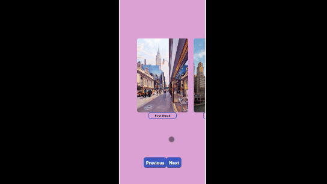

# CarouselApp

To run the app locally apply next steps in your terminal/console:

```
git clone https://github.com/PabloIVAgudo/CarouselApp.git
```
```
npm install
```
```
npm start
```

# Example of CarouselApp working

https://user-images.githubusercontent.com/84361788/131358706-7a4dc3e6-2c0e-4dec-a66a-3a06f791c315.mp4

<p align="center">
  
</p>